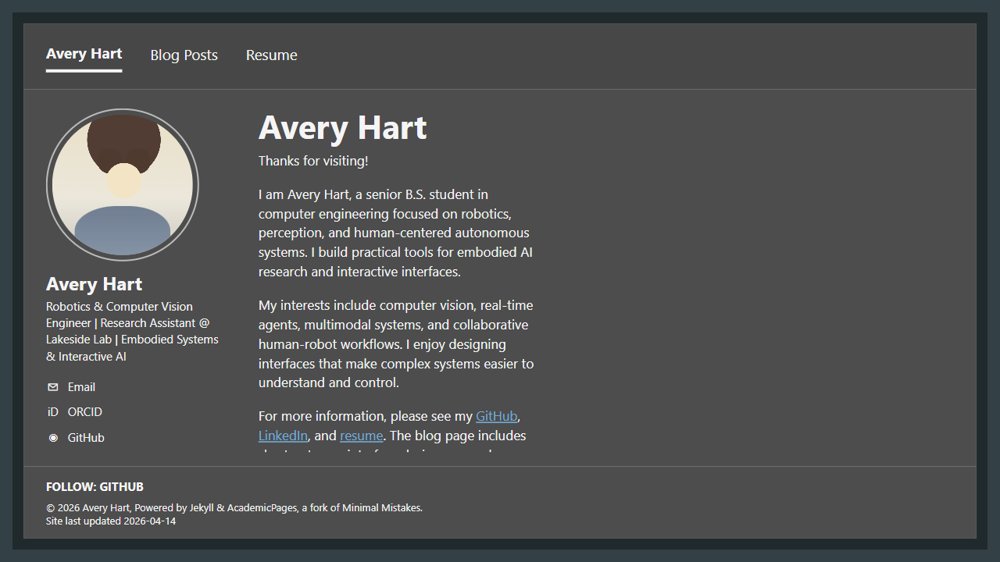

# Note 001

- Created: 2026-04-26T19:52:31Z
- Screenshot attached: yes

## Observation

Initial landing page observation at 1280x720: dark charcoal theme with top nav and footer is present. Home page shows Avery Hart name and role summary, but the main content appears vertically clipped in the viewport: the paragraph/link area near the bottom is cut off above the footer, and the left contact/profile list visibly shows Email, ORCID, and GitHub but LinkedIn is not visible in the current viewport. Need to verify whether this is due to page length/scroll versus layout clipping. Screenshot attached as evidence.

## Screenshot

