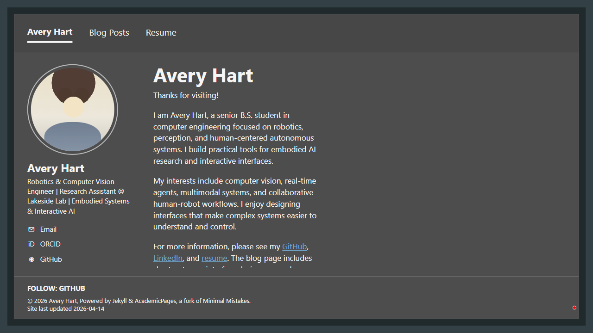

# Note 002

- Created: 2026-04-26T19:52:39Z
- Screenshot attached: yes

## Observation

Confirmed landing page content does not move when attempting to scroll, indicating the page fits within the viewport but lower content is clipped/truncated rather than simply below the fold. This affects readability of the final sentence/links in the main content and hides at least one expected profile row (LinkedIn) on the left. Severity: medium, because required content is not fully visible at the specified 1280x720 viewport.

## Screenshot

